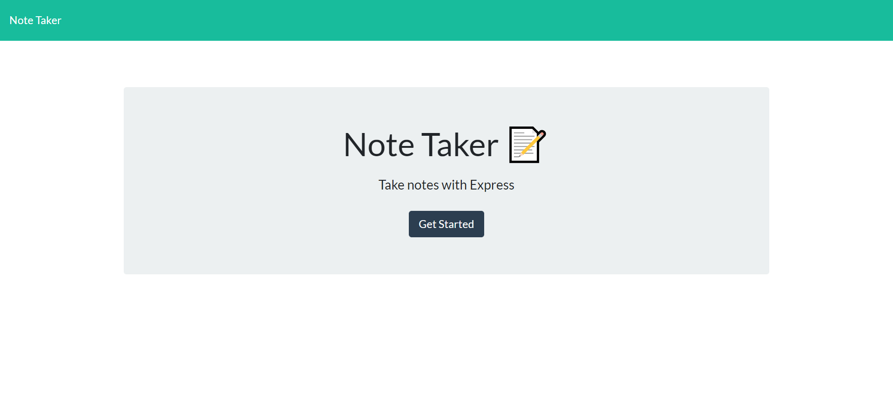
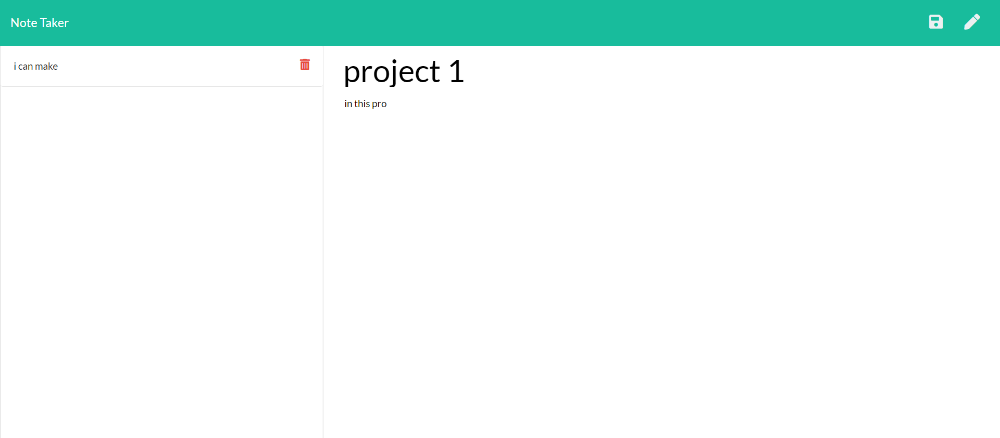

# Lets-Take-Notes.
http://lets-take-notes.herokuapp.com/

#### Matthew Cheney
#### matt1cheney@gmail.com
  
## a little about the project

With the use of Nodejs, expressjs, and uuid we run a get, post, and delete methods to successfully write a note and save it as well as delete it.  
  
# Before you start, You'll need this!

* 1.nodejs 
* 2.expressjs 
* 3.uuid
  
## The Purpose of the Application

A web application that can write and store your notes,as well as, delete them as the user pleases.
  
  
## Licensing
no licensing
  
## Contributing Guidelines
no contribution allowed.
  
# tests
install nodejs, express, uuid.

  
# questions

  
email: null.
    